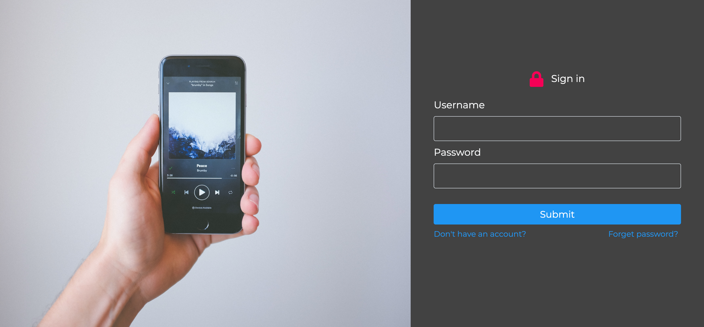
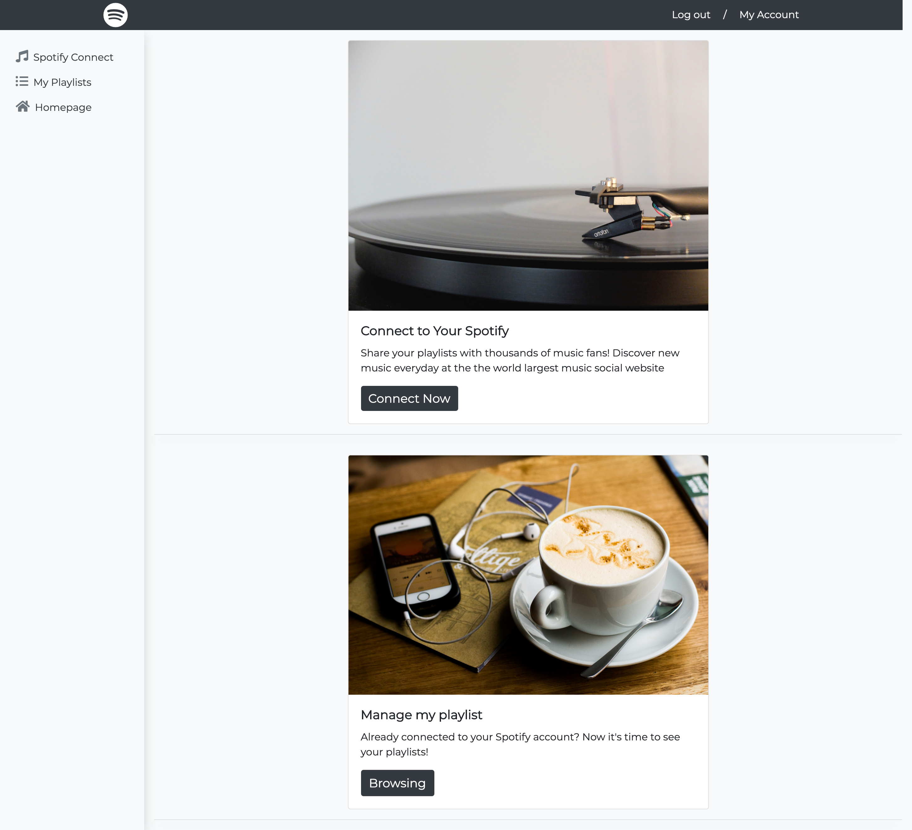
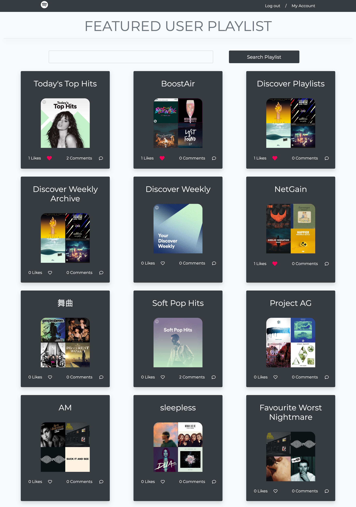
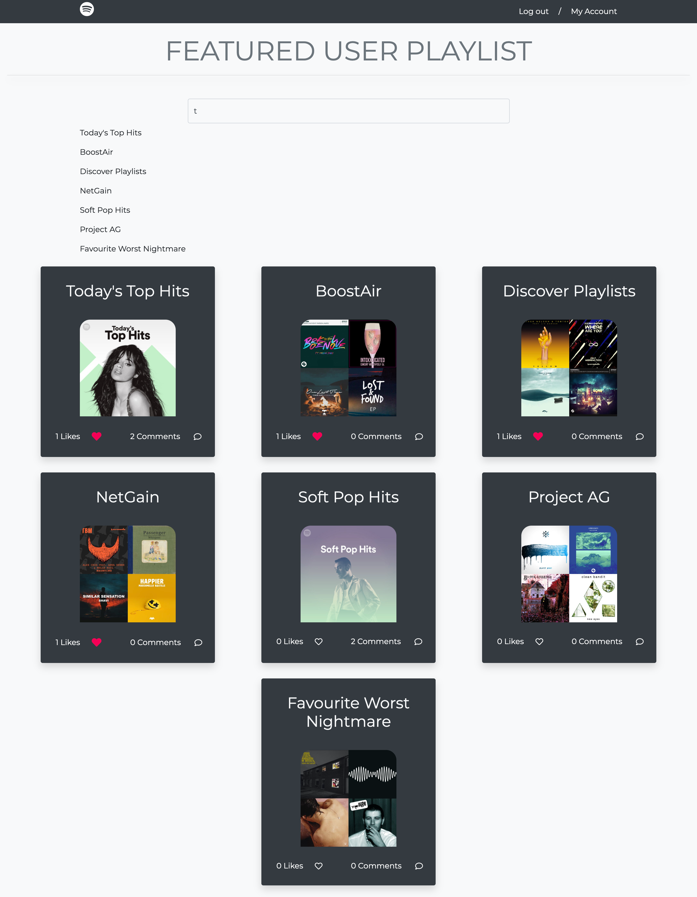

# Spotify Play
## This is the final group project for COMP 426 Mordern Web Programming. 
 
## I am responsible for the frontend, and my teammate focuses on backend. 

## Our website allows user to sign up and connect to their Spotify through Spotify API in their account page. 

## Then we will display all signed-up users' playlists for people to explore. Users can like and comment on other user's playlists!

## We also have a search function that allows users to search for playlists containing certain key words. Debouncing is used for smoothier search word recommendation experience.

