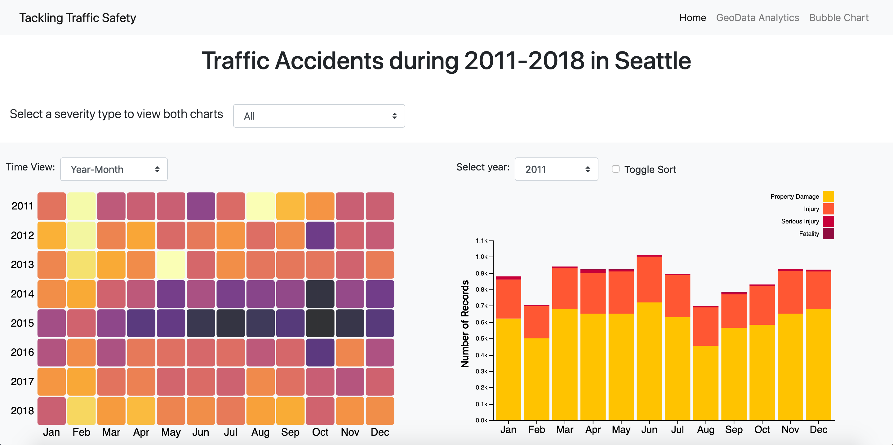
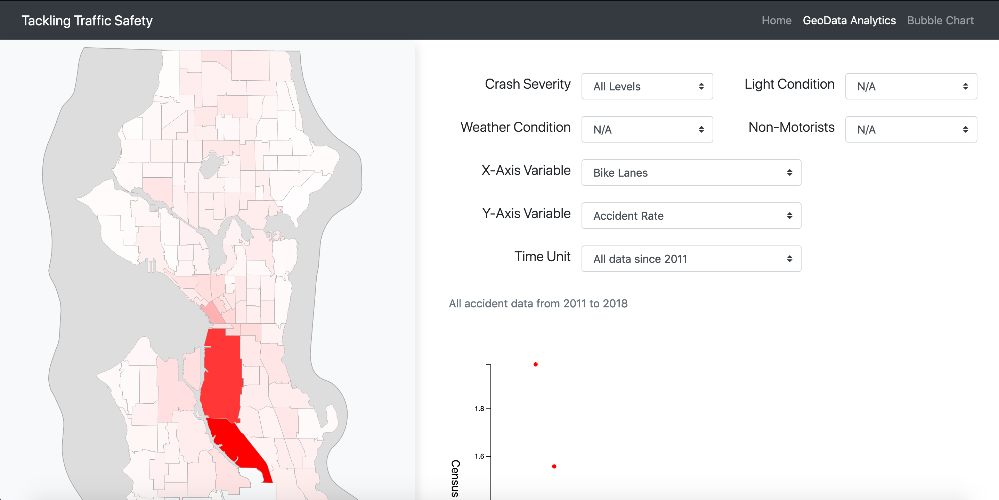
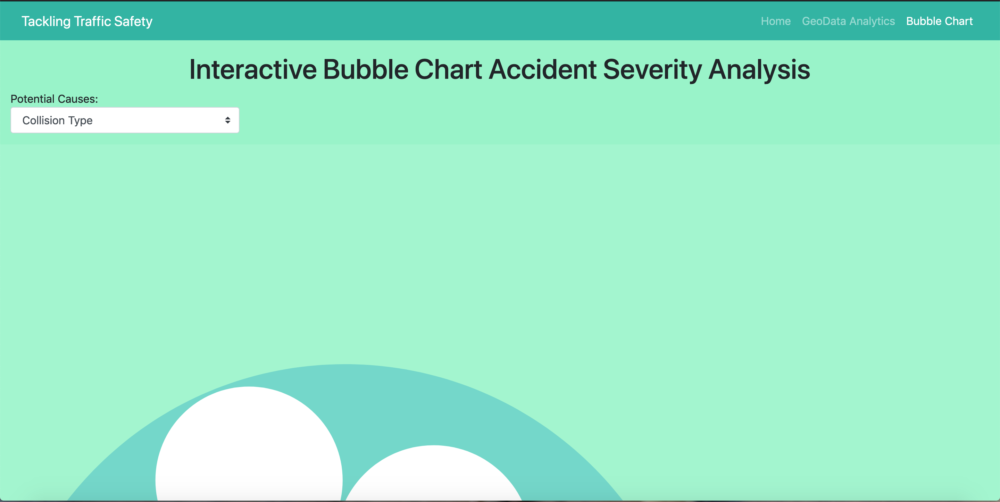

# Traffic Tackling Project

## Table of Contents

* [Introduction](#introduction)
* [Screenshots](#screenshots)

## Introduction
This project is the final class project for INLS 641 Visual Analytics. I am responsible for creating heatmap and integrating all final visualizations. 

The original data is from http://data-seattlecitygis.opendata.arcgis.com/datasets/collisions. We conducted data preprocessing and exploratory analysis in Python, then created ineractive visualizations using JavaScript D3 library to analyze patterns in Seattle traffic accidents data.

## Screenshots

